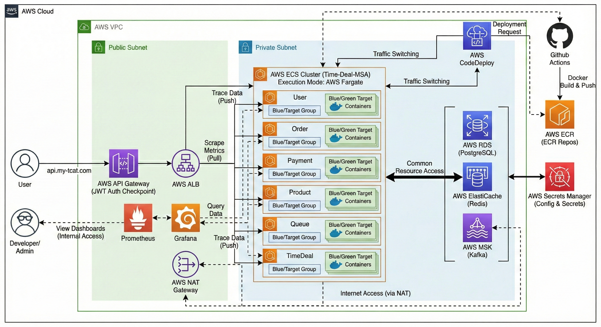
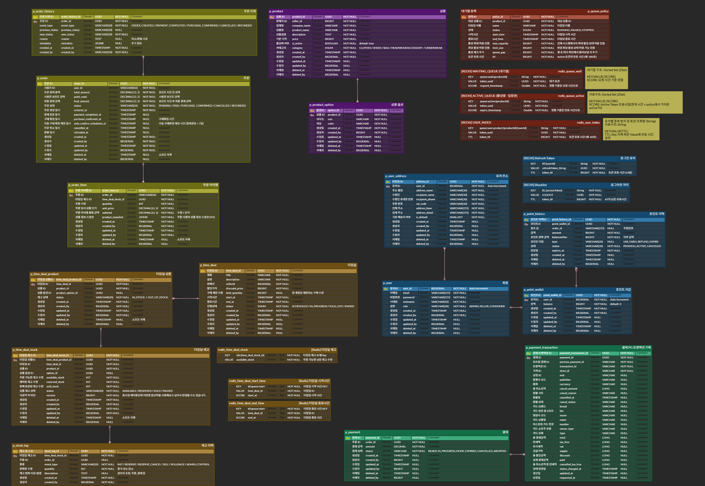

# ⏰ Rush Deal
> 트래픽 집중 상황을 고려한 MSA 기반 타임딜 이커머스 플랫폼


## 목차
- [프로젝트 소개](#-프로젝트-소개)
- [프로젝트 목표](#-프로젝트-목표)
- [로컬 실행 방법](#-로컬-실행-방법)
- [주요 기능](#-주요-기능)
- [리팩토링](#-리팩토링)
- [팀원 및 역할](#-팀원-및-역할)
- [기술 스택](#-기술-스택)
- [시스템 아키텍처](#-시스템-아키텍처)
- [ERD](#-erd)
- [프로젝트 구조](#-프로젝트-구조)


## 📌 프로젝트 소개
### 개요
한정된 시간, 수량 안에서 주문이 집중되는 타임딜 커머스 환경의 
MSA(Microservices Architecture) 기반 커머스 플랫폼입니다.

트래픽 집중 상황에서 발생할 수 있는 동시성, 정합성, 서비스 병목 문제 등을 
해결하기 위해 동시성 제어, 비동기 이벤트 기반 서비스 연동, Redis · Kafka · 모니터링 도구를 활용한
트래픽 처리 구조를 설계하고 구현했습니다.


## 🚩 프로젝트 목표
### 대규모 트래픽 대응
- MSA 기반 서비스 분리로 확장성 고려
- Redis, Kafka로 대규모 트래픽 안정적 처리
- 동시성 문제 없는 서비스
### 배포 및 운영
- Docker 기반 서비스별 실행 환경 통일
- docker-compose를 통한 인프라 및 서비스 일괄 실행
### 모니터링 시스템 구축
- Prometheus + Grafana를 활용한 메트릭 수집 및 시각화
- Zipkin을 통한 분산 트레이싱 및 병목 지점 분석


## ▶️ 로컬 실행 방법
1. 환경 변수 설정
2. Docker 컨테이너 실행
    ```
    docker-compose up -d
    ```


## **🔑** 주요 기능
### 프로젝트 주요 기능
#### Saga·Outbox 패턴 기반의 고신뢰 주문 결제 시스템
- 주문-재고-포인트 서비스 간 분산 트랜잭션을 Saga 패턴으로 관리하고, 장애 발생 시 자동 보상 트랜잭션 수행
- **이벤트 발행 성공률 99.9% 달성**
  - Outbox 패턴과 FOR UPDATE SKIP LOCKED를 조합해 DB 트랜잭션과 메시지 발행 간의 원자성 확보
- 멱등성 키 기반의 재시도 전략을 통해 네트워크 장애 및 Kafka 일시 장애 상황에서도 **95% 이상의 복구율** 구현

#### Redis Sorted Set 기반의 고가용성 대기열 시스템
- 대규모 트래픽으로 인한 DB 병목을 해결하기 위해 Redis Sorted Set 기반 대기열/활성열 구조 도입
- 전용 Executor(Thread Pool)와 CompletableFuture를 적용해 공용 스레드 풀 간섭 제거 및 비동기 처리 성능 최적화
- User Index Key 관리로 1인 1토큰 원칙 보장 및 중복 진입 원천 차단

#### 낙관적 락 + Redis 선제어를 결합한 타임딜 재고 관리
- Optimistic Lock으로 재고 수정 시 정합성 유지, Redis 선제어로 불필요한 DB 요청 사전 차단
- Redis Sorted Set 기반의 스케줄러 큐를 통해 타임딜 시작/종료 자동화

#### CQRS 및 2-Tier 캐싱을 통한 조회 성능 최적화
- CQRS 적용 & 2-Tier 전략으로 주문 조회 성능 **50배 향상 (500ms -> 10ms)**
- Cache Hit Rate 85~90% 유지로 시스템 처리 효율 극대화

#### PortOne 연동 결제 서비스
- PortOne 기반 결제 파이프라인 구축으로 결제 준비/완료/취소 구현
- 결제 취소 시 Kafka 이벤트 발행으로 비동기 도메인 연동

#### 사용자 및 포인트 시스템
- 포인트 적립/차감을 Kafka 이벤트로 연동해 도메인 간 결합도 최소화
- Redisson 분산 락으로 다중 요청 상황에서도 포인트 데이터 무결성 보장


## 🔧 리팩토링

<details>
<summary><h3>1. Outbox 패턴을 통한 Kafka 이벤트 발행 신뢰성 개선</h3></summary>

#### 문제 상황
- 결제 완료 후 Kafka 이벤트 발행 실패 시 재시도 메커니즘 부재
- DB 트랜잭션은 커밋되었으나 이벤트는 전송되지 않는 **데이터 불일치** 발생 가능
- 네트워크 장애나 Kafka 브로커 일시 장애 시 이벤트 유실 위험

#### 해결 방안
**Outbox 패턴을 적용하여 DB 트랜잭션과 이벤트 발행의 원자성 확보**

이벤트를 Kafka에 직접 발행하는 대신, DB 트랜잭션 내에서 Outbox 테이블에 먼저 저장한 후 별도 스케줄러가 주기적으로 발행을 시도합니다. 이를 통해 DB 커밋과 이벤트 발행 사이의 최종 일관성을 보장합니다.

```java

PaymentOutbox paymentOutbox = PaymentOutbox.create(
    "payment-complete-result",
    objectMapper.writeValueAsString(message)
);
paymentOutboxRepository.save(paymentOutbox);

transactionKafkaProducer.completePayment(message);

@Scheduled(fixedDelay = 5000)
public void publishPendingEvents() {
    List<PaymentOutbox> pendingEvents =
        paymentOutboxRepository.findByStatusOrderByCreatedAtAsc(
            OutboxStatus.PENDING, PageRequest.of(0, 100)
        );
}
```

#### 적용 위치
- `payment-service/src/main/java/com/rushcrew/payment_service/domain/model/PaymentOutbox.java`
- `payment-service/src/main/java/com/rushcrew/payment_service/infrastructure/kafka/TransactionKafkaProducer.java`
- `payment-service/src/main/java/com/rushcrew/payment_service/application/service/PaymentService.java:166-168`

#### 기대 효과
- DB 커밋과 이벤트 발행 간의 최종 일관성 보장
- 네트워크 장애 발생 시에도 스케줄러를 통한 자동 재시도로 이벤트 유실 방지
- Outbox 테이블을 통한 이벤트 발행 이력 추적 가능
- 재시도 횟수 제한(3회)으로 무한 루프 방지

</details>

<details>
<summary><h3>2. 상태 기반 보상 트랜잭션 개선</h3></summary>

#### 문제 상황
- 기존 보상 트랜잭션은 결제 상태와 무관하게 항상 PortOne 취소 API를 호출
- **PENDING 상태**(아직 결제되지 않음)에서도 불필요하게 취소 API 호출
- 동일한 보상 메시지 재처리 시 중복 취소 시도 가능

#### 해결 방안
**결제 상태에 따라 보상 전략을 분기 처리**

결제가 실제로 완료되지 않았다면 외부 PG API를 호출할 필요 없이 DB 상태만 변경하고, 이미 결제가 완료된 경우에만 실제 취소 API를 호출하도록 개선했습니다.

```java
switch (payment.getStatus()) {
    case PENDING -> {
        payment.failPayment();
        paymentRepository.save(payment);
    }
    case PAID -> {
        paymentService.cancelPayment(
            payment.getPaymentId(),
            "Saga rollback"
        ).block();
    }
    case CANCELLED, FAILED -> {
        log.info("결제가 이미 취소되었거나 실패했습니다 {}",
            payment.getPaymentId());
    }
}
```

#### 적용 위치
- `payment-service/src/main/java/com/rushcrew/payment_service/infrastructure/kafka/KafkaTransactionConsumer.java:39-50`

#### 기대 효과
- 불필요한 PG API 호출 제거로 외부 API 부하 감소
- 멱등성 보장: 동일한 보상 메시지 재처리 시에도 안전하게 처리
- 결제 상태별 명확한 보상 전략으로 코드 가독성 향상
- DB 상태 변경과 외부 API 호출을 분리하여 장애 격리

</details>

<details>
<summary><h3>3. Kafka Consumer 에러 핸들링 개선 (DLT 도입)</h3></summary>

#### 문제 상황
- Kafka 메시지 처리 중 예외 발생 시 적절한 재시도 전략 부재
- Deserialization 실패나 비즈니스 로직 에러 발생 시 일관된 처리 방법 없음
- 실패한 메시지 추적 및 모니터링 어려움

#### 해결 방안
**Dead Letter Topic (DLT)과 재시도 정책 적용**

Consumer에서 예외 발생 시 즉시 실패 처리하지 않고 일정 간격으로 재시도하며, 반복 실패하는 메시지는 별도의 DLT로 보내 정상 메시지 처리를 방해하지 않도록 개선했습니다.

```java
@KafkaListener(topics = "payment-transaction-result")
public void consume(final String message) {
    try {
    } catch (JsonProcessingException e) {
        throw new RuntimeException("Deserialization 실패", e);
    } catch (Exception e) {
        throw new RuntimeException("Processing 실패", e);
    }
}

factory.setCommonErrorHandler(new DefaultErrorHandler(
    new DeadLetterPublishingRecoverer(kafkaTemplate,
        (record, ex) -> new TopicPartition(
            record.topic() + ".DLT",
            record.partition()
        )),
    new FixedBackOff(1000L, 3L)
));
```

#### 적용 위치
- `payment-service/src/main/java/com/rushcrew/payment_service/infrastructure/kafka/KafkaTransactionConsumer.java:52-56, 67-71`
- `payment-service/src/main/java/com/rushcrew/payment_service/infrastructure/kafka/config/KafkaConsumerConfig.java:41-48`

#### 기대 효과
- 일시적 장애는 재시도를 통해 자동 복구
- 반복 실패 메시지는 DLT로 분리하여 정상 메시지 처리 흐름에 영향 없음
- DLT를 통한 실패 메시지 추적 및 분석 가능
- Consumer 장애 발생 시에도 메시지 유실 방지

</details>

<details>
<summary><h3>4. JPA 낙관적 락을 통한 결제 동시성 제어</h3></summary>

#### 문제 상황
- 동일한 결제 건에 대해 동시 요청 발생 시 중복 처리 가능성
  - 사용자의 결제 완료 버튼 다중 클릭
  - PortOne 웹훅 중복 수신
  - Kafka 메시지 재처리로 인한 보상 트랜잭션 중복 실행
- 단순 DB 트랜잭션만으로는 동시성 제어 한계

#### 해결 방안
**JPA `@Version`을 활용한 낙관적 락 적용**

Payment 엔티티에 버전 필드를 추가하여 동일한 데이터를 동시에 수정하려는 시도를 감지하고 차단합니다. 먼저 조회한 요청만 성공하고 나머지는 예외가 발생하여 중복 처리를 방지합니다.

```java
@Entity
public class Payment {
    @Version
    private Long version;
    // ...
}

try {
    paymentRepository.save(payment);
} catch (ObjectOptimisticLockingFailureException e) {
    throw new BusinessException(
        PaymentErrorCode.CONCURRENT_UPDATE_DETECTED
    );
}
```

**동작 원리**
```
요청 A: Payment 조회 (version=0) → update → 성공 (version=1)
요청 B: Payment 조회 (version=0) → update → 실패 (version 불일치)
→ OptimisticLockingFailureException 발생
```

#### 적용 위치
- `payment-service/src/main/java/com/rushcrew/payment_service/domain/model/Payment.java:35-36`
- `payment-service/src/main/java/com/rushcrew/payment_service/application/service/PaymentService.java:143-147, 98-102`
- `payment-service/src/main/java/com/rushcrew/payment_service/infrastructure/kafka/KafkaTransactionConsumer.java:43-48`
- `payment-service/src/main/java/com/rushcrew/payment_service/domain/exception/PaymentErrorCode.java:21`

#### 기대 효과
- 동시 요청 중 하나만 성공하고 나머지는 예외 발생으로 중복 처리 방지
- 별도의 분산 락 없이 DB 레벨에서 동시성 제어 가능
- 외부 PG API 중복 호출 사전 차단으로 불필요한 API 호출 방지
- Kafka Consumer에서 낙관적 락 실패 시 재시도를 통해 최신 상태로 처리

</details>


## 🧑‍🤝‍🧑 팀원 및 역할
| 이름                                     | 담당 업무             |
|----------------------------------------|-------------------|
| [변영재(팀장)](https://github.com/bbangjae) | 인증 및 인가, 사용자, 포인트 |
| [김민수](https://github.com/Doritosch)    | 결제, 모니터링          |
| [민송경](https://github.com/miiiiiin)     | 대기열, 배포           |
| [유민아](https://github.com/minahYu)      | 상품, 타임딜, 재고       |
| [차초희](https://github.com/chachohee)    | 주문                |


## 🛠 기술 스택
### Back-End
- Java 21
- Spring Boot 3.5.8
- Spring Security
- Spring Data JPA
- Spring Data Redis
- Spring Kafka
- PostgreSQL
- Spring Cloud Gateway
- Eureka
- OpenFeign

### Infrastructure
- AWS
  - ECS
  - RDS (PostgreSQL)
  - Elastic Cache (Redis)
  - MSK (Kafka)
  - ECR
- Docker & Docker Compose
- Github Actions

### Monitoring
- Prometheus
- Grafana
- Zipkin

## 🔁 Flowchart


## 🏗 시스템 아키텍처


## 🗄 ERD


## 📂 프로젝트 구조
```
rush-deal
├── api-gateway         # 요청 라우팅 및 인증 처리
├── auth-service        # 인증 및 토큰 관리
├── discovery-service   # 서비스 디스커버리 (Eureka)
├── order-service       # 주문 처리
├── payment-service     # 결제 처리
├── product-service     # 상품 및 옵션 관리
├── timedeal-service    # 타임딜 및 재고 도메인
├── user-service        # 사용자 및 포인트 관리
├── queue-service       # 대기열 서비스
├── monitoring          # 모니터링
├── docker-compose.yml
├── docker-compose-monitoring.yml
└── README.md
```
